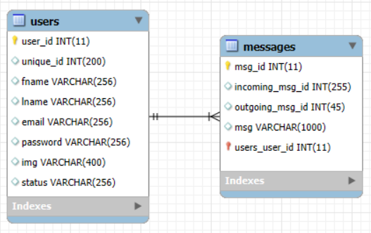

# Realtime Chat Application  

A dynamic and responsive real-time chat application built using **HTML**, **CSS**, **JavaScript**, **AJAX**, **PHP**, and **MySQL**. This project enables users to communicate seamlessly with instant message updates and a user-friendly interface.  

## Features  

- **User Authentication**: Secure login and registration system.  
- **Real-time Messaging**: Instantly send and receive messages without refreshing the page.  
- **Dynamic User Interface**: Responsive and modern design with user-specific details.  
- **AJAX for Smooth Operations**: Handles asynchronous data updates and seamless communication between the client and server.  
- **Database Integration**: User and message data stored securely in a MySQL database.  
- **Error Handling**: Logs errors during AJAX requests and prevents invalid operations.  
- **Session Management**: Ensures authenticated access for users.  


---


## Technologies Used  

### Frontend  
- **HTML**: Structure and layout of the application.  
- **CSS**: Styling for a responsive and aesthetic UI.  
- **JavaScript**: Dynamic client-side interactions.  
- **AJAX**: Real-time communication with the server.  

### Backend  
- **PHP**: Server-side logic and database interaction.  
- **MySQL**: Database to store user data and messages.  


---


## Database Schema  

### `users` Table  
Stores user account details:  
- `user_id` (Primary Key): Auto-incremented unique ID for each user.  
- `unique_id`: Random unique identifier for users.  
- `fname`: User's first name.  
- `lname`: User's last name.  
- `email`: User's email address.  
- `password`: Encrypted password for secure login.  
- `img`: Path to the user's profile image.  
- `status`: Current status (e.g., "Online", "Offline").  

### `messages` Table  
Stores chat messages:  
- `msg_id` (Primary Key): Auto-incremented unique ID for each message.  
- `incoming_msg_id`: ID of the recipient user.  
- `outgoing_msg_id`: ID of the sender user.  
- `msg`: Content of the message.  



---


## Installation  

1. Clone the repository:  
   ```bash  
   git clone https://github.com/mohamad-abdelkhalek/realtime-chat-app.git
   
### Set up the Database:  
1. Create a MySQL database and import the provided `database.sql` file.  

### Configure the Backend:  
1. Update `config.php` with your database credentials.  

### Start the Server:  
1. Use a local server like **XAMPP** or **WAMP** to run the project.  
2. Place the project files in the server's root directory (e.g., `htdocs` for XAMPP).  

### Access the Application:  
1. Navigate to `http://localhost/<project-folder>/` in your web browser.  

---

## How to Use  

1. Register a new account or log in with an existing one.  
2. View the list of active users.  
3. Start a conversation by clicking on a user.  
4. Type a message and send it to see real-time updates in the chat window.  

---

## Future Improvements  

- Add file-sharing functionality (images, documents).  
- Implement group chats and chat rooms.  
- Integrate push notifications for message alerts.  
- Enhance security with password hashing and validation.  
- Optimize for performance with WebSocket integration.  

